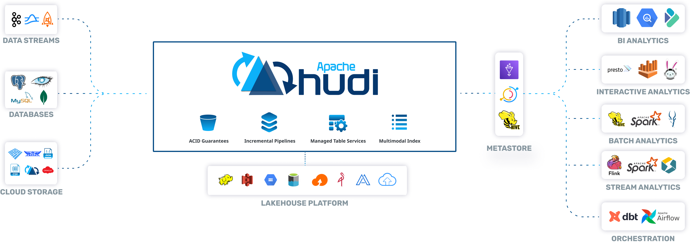

# 第1章 Hudi 概述

## 1.1 Hudi 简介

​	Hudi 是下一代流数据湖平台。Apache Hudi 将核心仓库和数据库功能直接引入数据湖。Hudi提供了表、事物、高效的upserts/delete、高级索引、流摄取服务、数据集群/压缩优化和并发，同时保持数据的开源文件格式(parquet、avro)。解决传统数据仓库的痛点。

​	Hudi 不仅适合流工作负载，而且还允许创建高效的增量批处理管道。

## 1.2 发展历史

* 2015年：发表了增量处理的核心思想和原则。
* 2016年：由Uber创建并为所有的数据库/关键业务提供支持。
* 2018年：吸引大量的使用者。
* 2019年：成为ASF孵化项目，并增加更多的平台组件。
* 2020年：毕业成为Apache顶级项目，社区、下载量、采用率增长超过十倍。
* 2021年：支持Uber 500 PB数据湖，SQL DML、Flink集成、索引、元服务器、缓存。

## 1.3 Hudi特性

* 可插拔索引机制，支持快速的Upsert/Delete。
* 支持增量拉取表变更以进行处理。
* 支持事务提交回滚，并发控制。
* 支持Spark，Presto，Flink，Hive等引擎的SQL读写。
* 自动管理小文件，数据聚簇，压缩，清理。
* 流式摄入，内置CDC源和工具。
* 内置可扩展存储访问的元数据跟踪。
* 向后兼容的方式实现表结构变更的支持。

## 1.4 使用场景

1. 近实时写入
   * 减少碎片化工具的使用。
   * CDC增量导入RDBMS数据。
   * 限制小文件的大小和数量。
2. 近实时分析
   * 相对于秒级存储，节省资源。
   * 提供分钟级别时效性，支撑更高效的查询。
   * Hudi作为lib，非常轻量。
3. 增量pipeline
   * 区分arrive time和event time 处理延迟数据。
   * 更短的调度interval 减少端到端延迟。
4. 增量导出
   * 替代部分Kafka的场景，数据导出到在线服务存储。
