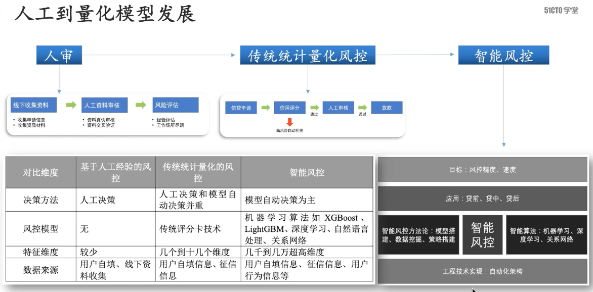
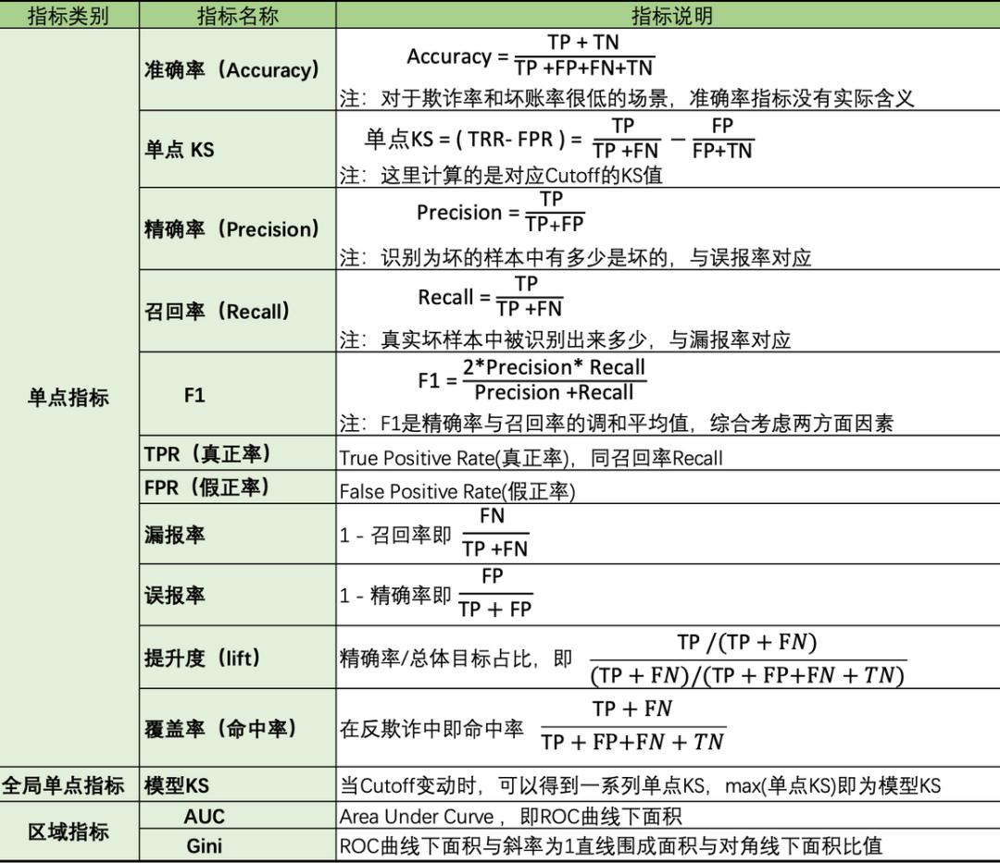

# 评分卡模型

## 模型的常见分类

1. 有监督学习：有监督学习需要标识的数据。可为正/负例或连续数值。
2. 无监督学习：无监督学习不需要标识数据。
3. 半监督学习：训练阶段结合了大量未标记的数据和少量标签数据。
4. 增强学习：边获得样例边学习的方式，利用当前模型来指导下一步，以获得奖励，目标是获得更多的奖励。

### 有监督学习

1. 回归：

   > 目标数据为联系数值。例如：额度、收入、负债。

2. 分类：

   > 目标数据为分类数据，比如二分类一般用0/1标签表示。

3. 常见算法：

   > 线形回归，逻辑回归，决策树，深度学习，支持向量机，集成模型：Bagging、Boosting、Stacking。

### 无监督学习

1. 聚类：

   > 将一堆零散的数据根据某些标准分为几个类别。

2. 降维：

   > 保证数据所具有的代表性特征或分布的情况下，将高纬数据转化为低纬数据。

3. 常见算法：

   > k- means，层次聚类，主成分分析，因子分析。

## 分箱方法

1. **等宽分箱**：每个箱的宽度是相同的，即将数据范围划分为n个等宽的区间。这种方法简单直接，但可能不适用于数据分布不均匀的情况。
2. **等频分箱**：每个箱包含的数据量是相同的，即根据数据值排序后，平均分配到各个箱中。这样可以保证每个箱的重要性相同，但是可能会导致箱内数据差异较大。
3. **基于聚类的分箱**：使用聚类算法（如K-means）对数据进行分组，使得同一组内的数据相似度尽可能高，而不同组之间的差异尽可能大。这种方法比较灵活，适用于各种数据分布情况，但需要选择合适的聚类算法和参数。
4. **基于决策树的分箱**：利用决策树模型自动找到最佳的分割点来划分数据。该方法能够考虑到目标变量的影响，从而生成具有较高预测能力的箱。适用于分类问题中的特征离散化。
5. **基于卡方检验的分箱**：通过卡方检验来决定如何合并数据区间，直到满足某个停止条件为止。此方法特别适合于分类变量与目标变量之间关系的研究。

## 指标评估

### WOE（Weight of Evidence，证据权重）

#### 定义

WOE(**Weight Of Evidence 证据权重**)是一种对自变量编码的方法，需注意的是在WOE编码前需对数据进行**分箱**操作。

WOE 用于衡量某个分箱中正类和负类的分布差异，常用于特征分箱和转换。

具体而言，对于特征每个分组的WOE值计算公式如下：
$$
WOE_i = \ln\left(\frac{Good_i / Total\ Good}{Bad_i / Total\ Bad}\right)
$$

#### 特点

* WOE值越高，表示该分箱中正类比例越高。
* WOE值越低，表示该分箱中负类比例越高。

#### 应用场景

- 特征分箱：将连续变量转换为离散变量。
- 特征转换：将原始特征转换为 WOE 值，提升模型的线性可分性。

### IV（Information Value，信息值）

#### **定义**

IV 用于衡量特征对目标变量的预测能力，常用于特征选择。

#### **计算公式**

$$
IV = \sum_{i=1}^{n} \left( \frac{Good_i}{Total\ Good} - \frac{Bad_i}{Total\ Bad} \right) \times WOE_i
$$

其中，Good~i~和Bad~i~ 分别表示第 i 个分箱中的正类和负类样本数，WOE~i~ 是第 i 个分箱的 WOE 值。

#### **评估标准**

- IV < 0.02：特征无预测能力。
- 0.02 ≤ IV < 0.1：特征预测能力较弱。
- 0.1 ≤ IV < 0.3：特征预测能力中等。
- IV ≥ 0.3：特征预测能力强。

#### **应用场景**

- 特征选择：选择 IV 值较高的特征用于建模。
- 模型解释：评估特征对目标变量的重要性。

### **PSI（Population Stability Index，群体稳定性指数）**

#### **定义**

PSI 用于衡量两个群体（如训练集和测试集）的分布差异，常用于模型监控。

#### **计算公式**

$$
PSI = \sum_{i=1}^{n} (Actual_i - Expected_i) \times \ln\left(\frac{Actual_i}{Expected_i}\right) 
$$

其中，Actual~i~ 和 Expected~i~ 分别表示实际群体和预期群体在第 i 个分箱中的比例。

#### **评估标准**

- PSI < 0.1：群体分布稳定。
- 0.1 ≤ PSI < 0.25：群体分布有轻微变化，需关注。
- PSI ≥ 0.25：群体分布显著变化，需重新评估模型。

#### **应用场景**

- 模型监控：监控模型在生产环境中的表现是否稳定。
- 数据分布变化检测：检测训练数据与实际数据之间的分布差异。

###  **LIFT（提升度）**

#### **定义**

LIFT 衡量模型预测结果相对于随机选择的提升效果，常用于评估分类模型的表现。

#### **计算公式**

$$
LIFT = \frac{\text{模型预测的正类比例}}{\text{实际正类的基准比例}}
$$

#### **评估标准**

- LIFT > 1：模型表现优于随机选择。
- LIFT = 1：模型表现与随机选择相同。
- LIFT < 1：模型表现差于随机选择。

#### **应用场景**

- 评估模型在 top N 分位数中的表现。
- 用于营销活动中的客户响应预测，选择高概率响应客户。

### KS（Kolmogorov-Smirnov）

#### 定义

在风控中，KS常用于评估模型区分度。区分度越大，说明模型的风险排序能力（ranking ability）越强。

#### 计算公式

$$
KS = \max \left\{ \left| \text{cum}(bad\_rate) - \text{cum}(good\_rate) \right| \right\}
$$

其中cum(bad_rate) 是“坏客户”的累积分布函数，cum(good_rate)是“好客户”的累积分布函数。

KS统计量是这两个累积分布函数之间最大绝对差值。

### 混淆矩阵

| 混淆矩阵       | 预测为正类  | 预测为负类  |
| -------------- | ----------- | ----------- |
| **实际为正类** | 真阳性 (TP) | 假阴性 (FN) |
| **实际为负类** | 假阳性 (FP) | 真阴性 (TN) |

> 真阳率 (TPR)：$ TPR = \frac{TP}{Positive} = \frac{TP}{TP + FN} $
>
> 假阳率 (FPR)：$ FPR = \frac{FP}{Negative} = \frac{FP}{FP + TN} $

## 其他指标

